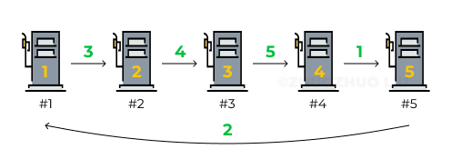
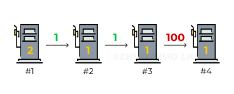
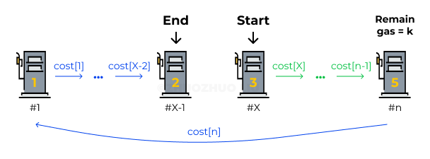
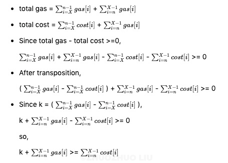

# #134. Gas Station || Step-by-step Explanation(with graph) || Beginners Friendly

# Problem


There are N gas stations along a circular route, where the amount of gas at station i is gas[i].

You have a car with an unlimited gas tank and it costs cost[i] of gas to travel from station i to its next station (i+1). You begin the journey with an empty tank at one of the gas stations.

Return the starting gas station's index if you can travel around the circuit once in the clockwise direction, otherwise return -1.

Note:

If there exists a solution, it is guaranteed to be unique. Both input arrays are non-empty and have the same length. Each element in the input arrays is a non-negative integer.

## Author's note
This question may use greedy algorithm which involves mathematical proofs.

# Idea 1: Brute Force
We will have to start from every station and check if we have enough gas to go to the next station with `remainGas = remainGas + gas[station] - cost[station]`. If not `remainGas < 0`, we break and move the starting point to the next station and keep checking until we find a starting point that sustains us to travel around.

## Time cost
O(n). Because we have two pointers (both traverse O(n) times) and one is nested in the other one. 

## Code
```java
class Solution {
    public int canCompleteCircuit(int[] gas, int[] cost) {
        int n = gas.length;
        for (int i = 0; i < n; i++) {
            int remainGas = 0;
            boolean isSuccess = true;
            for (int j = i; j < n + i; j++) {
                int station = (j+n) % n;
                remainGas += gas[station] - cost[station];
                if (remainGas < 0) {
                    isSuccess = false;
                    break;
                }
            }
            if (isSuccess) {
                return i;
            }
        }
        return -1;
    }
}
```

# Idea 2: One pass
After coming up with brute force, you always ask yourself, are all procedures or calculations necessary? The answer is NO. The solution depends on 3 properties. Every property saves us a bunch of work compared to brute force.

## Code
Let's reveal the algorithm first and then analyze properties and how they help with simplifying the procedure.
```java
class Solution {
    public int canCompleteCircuit(int[] gas, int[] cost) {
        int remainGas = 0;
        int totalGas = 0;
        int totalCost = 0;
        int start = 0;
        // Property 1: We compare total gas and total cost. 
        for (int i = 0; i < gas.length; i++) {
            totalGas += gas[i];
            totalCost += cost[i];
        }
        // If total gas doesn't cover total cost, it doesn't work out and we return -1.
        if (totalGas < totalCost) {
            return -1;
        }
        // If total gas can cover the cost, we set up a pointer i starting from #1 and traverse. Property 3: no loop around, i < gas.length.
        for (int i = 0; i < gas.length; i++) {
            // Arriving at each station, we calculate the remaining gas
            remainGas += gas[i] - cost[i];
            // If the remainGas < 0, that means it's impossible to arrive at this station - it will be an unsuccessful route.
            if (remainGas < 0) {
                // Property 2: we set the remaining gas to 0, and move the starting point to the next station and test again until we find a successful route (remainGas >=0 at every station).
                start = i+1;
                remainGas = 0;
            }
        }
        return start;
    }
}
```

## Property 1. If total gas < total cost, a successful route doesn't exist.
This is obvious.

Question: How to prove that if total gas >= total cost, there must be a successful route?

### Simplify the code
With this property, we can check at the very beginning (or at the end). 
```java
for (int i = 0; i < gas.length; i++) {
            totalGas += gas[i];
            totalCost += cost[i];
        }
        // If total gas doesn't cover total cost, it doesn't work out and we return -1.
        if (totalGas < totalCost) {
            return -1;
```

## Property 2. If path(#i -> #j) failed, it will also fail if we start with any station between #i and #j.


Consider this graph as an example: if we start from #1: 
* path(#1 -> #3) is successful
* path(#3 -> #4) fails

With the brute force idea, if #1 doesn't work out we have to start with #2 to check. Is it necessary? No. We don't have to check from #2 because we've known that it won't pass #4.


Why? Starting from #2 can be equal to starting from #1, adding 1 gas at #1 (originally gas = 2 at #1). That equals to, #1 doesn't provide us any benefits. 

We knew that path(#1 -> #4) fails. That's being said, even if #1 provides us some extra benefits to let us have gas remaining when arriving at #2, that gas doesn't sustain us to pass #4. 

Therefore, path(#2 -> #4) wouldn't work. We can prove in contradiction. If it works, path(#1 -> #4) should work as well because #1 may provide extra gas for the trip which contradicts with the assumption "path(#1 -> #4) fails".

### Simplify the code

With this property, we further conclude that, once we find a failed path(#i -> #j), we can set up the starting point from the next point #j+1. In the code, `start = i+1`.

## Property 3. With enough total gas, if there's a successful path(#X -> #last station), starting point #X must be valid (no need to loop back to check).

That's being said, if we find a starting point X that can reach the last station, we don't have to loop back to check stations before X. The gas will always be enough to cover the rest trip (in this example, #5 is the last station but may not be the last one in the route because the starting point is not always #1).

It sounds unbelievable. Let's prove. In this graph, the whole route is divided by green section path(#X -> #n) and blue section path(#n -> #X-1). We want to prove that if the green section works, the blue section must work.



### Notations

* #X = starting point
* #n = last station in alphabetics
* k = the remaining gas after going path(#X -> #n) (before adding gas from #n)

### Proof

* Total gas = $\sum_{i=X}^{n-1} gas[i]$ + $\sum_{i=n}^{X-1} gas[i]$
* Total cost = $\sum_{i=X}^{n-1} cost[i]$ + $\sum_{i=n}^{X-1} gas[i]$
* Since total gas - total cost >=0,

    $\sum_{i=X}^{n-1} gas[i]$ + $\sum_{i=n}^{X-1} gas[i]$ - $\sum_{i=X}^{n-1} cost[i]$ - $\sum_{i=n}^{X-1} cost[i]$ >= 0

* After transposition,

    ( $\sum_{i=X}^{n-1} gas[i]$ - $\sum_{i=X}^{n-1} cost[i]$ ) + $\sum_{i=n}^{X-1} gas[i]$ - $\sum_{i=n}^{X-1} cost[i]$ >= 0

* Since k = ( $\sum_{i=X}^{n-1} gas[i]$ - $\sum_{i=X}^{n-1} cost[i]$ ),

    k + $\sum_{i=n}^{X-1} gas[i]$ - $\sum_{i=n}^{X-1} cost[i]$ >= 0

    so,
    
    k + $\sum_{i=n}^{X-1} gas[i]$ >= $\sum_{i=n}^{X-1} cost[i]$
    
(If the above doesn't format, see the image below.)
    


This formula shows that the sum of x remaining gas at #n and the gas being added must be able to cover the cost during the blue section. Therefore, as long as the green section works, the blue section must work.

### Simplify the code
With this property, we don't have to circle around and check the stations in front of the starting point. So the loop is `for (int i = 0; i < gas.length; i++)`.
