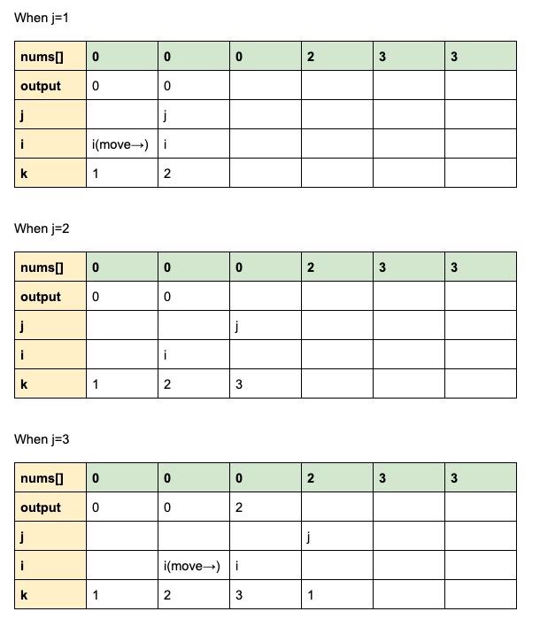
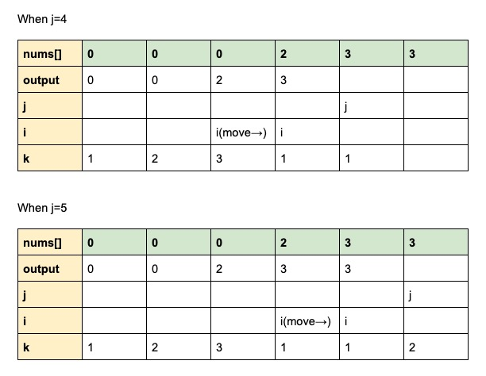

# Leetcode #80. Remove Duplicates from Sorted Array || Step-by-step explanation (with graph) || Beginner-friendly
# Problem
Given a sorted array nums, remove the duplicates in-place such that duplicates appeared at most twice and return the new length.
Do not allocate extra space for another array, you must do this by modifying the input array in-place with O(1) extra memory.

# Author’s note
This question is asking us to return a “new length”. However, as we know, the array’s length is immutable in Java. It’s actually asking us to REPLACE the duplicate with other “safe” numbers and return the length of the “prefix” of this array. We don’t care what the rest looks like - only make sure the “prefix” is correct.

# Prerequisites
Before solving this question, you should have completed #27. Remove Element and #26. Remove Duplicates from Sorted Array.

# Idea 1: Counting the duplicate
1. It’s asking us to keep the 1st duplicate number and remove other duplicates if any. If the array is [0, 0, 1, 1, 1, 2, 3, 3], we need to remove the 3rd 1 and keep the rest.
2. Let’s call a number “safe” if it’s our 1st and 2nd time to see it. We call it “unsafe” if we see it more than twice. We need to keep safe numbers and replace the unsafe numbers.
3. Therefore, we need a counter k to count the ordinal of duplicates:
* k=1 means it’s the 1st time we see a certain number. It’s a 1st-time safe number.
* k=2 means it’s the 2nd time we see a certain number. It’s a 2nd-time safe number.
* A safe number can either be a 1st-time safe number or a 2nd-time safe number.
* k=3 means it’s the 3rd time we see a certain number. It’s an unsafe number that we need to replace.
4. What should be replaced with the unsafe number? The answer is a new safe number.
* We need a pointer j to traverse all numbers to find new safe numbers.
* We also need a pointer i to mark the last safe number.
* Pointer i will wait on its position until pointer j found a new safe number.


## Code
If you don’t fully understand the idea above, no worries! Code will tell the story by itself. Let me explain line by line.
```java
    public int removeDuplicates(int[] nums) {
        //Set up pointer i to mark the last safe number. Initialize it to 0 to start from the first number.
        int i = 0;
        //Set up counter k to count the ordinal of duplicates. Initialize it to 1 to denote the "kth" time that we see a number.
        int k = 1;

        //Create a loop where j can traverse all numbers in the array, except the first number (because we use 2 pointers so the first number has been represented by i=0)
        for (int j = 1; j < nums.length; j++) {
            //When nums[i] == nums[j], we have found a duplicate number. Maybe it's safe if it's a 2nd-time safe number. So we use k to count the ordinal of this duplicate.
            if (nums[i] == nums[j]) {
                k++;

                //Pointer i moves by 1 when we found a 2nd-time safe number. We assign that value to nums[i+1].
                if (k == 2) {
                i++;
                nums[i] = nums[j];
            }
            //We don't do anything if k>=3. Pointer i wait for j finding a safe number.
            //When nums[i] != nums [j], pointer i moves by 1 since we found a different number - a 1st-time safe number. We assign that value to nums[i+1].
            } else {
                k = 1;
                i++;
                nums[i] = nums[j];
            }
        }
        return i+1;
    }
```

## Iterations graph




# Idea 2: Comparing with nums[i-1]
Is the counter necessary? Can we not use counter? Yes!

Let's recall what we can do without the counter. We have nums[j] who is traversing all numbers to find safe numbers. We have a "prefix" array from nums[0] to nums[i] which contains a "correct" output that i has been "guarding". Since we don't use counter this time, counter k is out.

How to identify if a new number nums[j] is safe or not? We can compare nums[j] with the second-to-last numbers in the "prefix" array that is nums[i-1]. If nums[j] == nums[i-1], nums[j] is not the safe number. If nums[j] != nums[i-1], nums[j] must be a safe number.

Why? Let's assume nums[j] = nums[i-1] = 7, there's only 1 scenario, that is: 
i-1          | i             | j           
------------ | ------------- | -------------
7            | 7             | 7            
All numbers from nums[i-1] to nums[j] are the same! So nums[j] is at least a 3rd-time duplicate unsafe number. This is why we need to compare it with nums[i-1] instead of nums[i].

To satisfy our curiosity - what happens when nums[j] != nums[i-1]? There are 3 scenarios: 
i-1          | i             | j           
------------ | ------------- | -------------
7            | 7             | 9             
7            | 9             | 9            
7            | 8             | 9            

nums[j] is safe in all scenarios!

Therefore, we understand why it's a nice idea to compare nums[j] with nums[i-1].

## Code
```java
class Solution {
    public int removeDuplicates(int[] nums) {
        int i = 0;
        for (int j = 1; j < nums.length; j++) {
            if (i < 1 || nums[j] != nums[i-1]) {
                i++;
                nums[i] = nums[j];
            }
        }
        return i+1;
    }
}
```
We can simplify it by using foreach loop since we are not interested in index j:
```java
class Solution {
    public int removeDuplicates(int[] nums) {
        int i = 0;
        for (n : nums) {
            if (i < 1 || n != nums[i-1]) {
                i++;
                nums[i] = n;
            }
            
        }
        return i+1;
    }
}
```
Hope this explanation helps! You can find it on [Leetcode discussions board](https://leetcode.com/problems/remove-duplicates-from-sorted-array-ii/discuss/792178/Java-oror-2-pointers-100-faster-oror-Step-by-step-explanation-(with-graph)-oror-Beginners-friendly) as well. If it helps you, upvote please!
